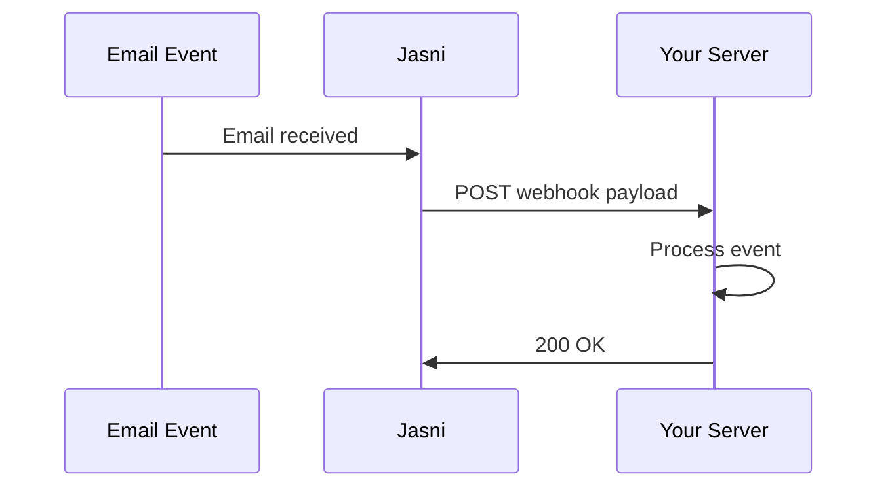

## Overview

Webhooks allow you to receive real-time HTTP notifications when events occur in your Jasni account. Instead of polling the API for changes, webhooks push data to your server instantly when something happens.

<Note>
  Webhooks are essential for building responsive AI email agents that need to react immediately to incoming emails.
</Note>

## How Webhooks Work



1. An event occurs (e.g., new email received)
2. Jasni sends an HTTP POST request to your webhook URL
3. Your server processes the event
4. Your server responds with a `200` status code

## Webhook Events

Jasni supports the following webhook events:

| Event | Description |
|-------|-------------|
| `email.received` | A new email was received |
| `email.sent` | An email was sent successfully |
| `email.bounced` | An email bounced |
| `email.spam` | An email was marked as spam |
| `email.deleted` | An email was deleted |

## Creating a Webhook

Register a webhook endpoint to start receiving events:

```json
POST /api/v1/webhooks
{
  "url": "https://your-server.com/webhooks/jasni",
  "events": ["email.received", "email.sent"],
  "description": "Production webhook"
}
```

### Response

```json
{
  "success": true,
  "data": {
    "webhook": {
      "id": "550e8400-e29b-41d4-a716-446655440000",
      "url": "https://your-server.com/webhooks/jasni",
      "events": ["email.received", "email.sent"],
      "active": true,
      "description": "Production webhook",
      "secret": "whsec_abc123...",
      "created_at": "2024-01-15T10:30:00Z"
    }
  }
}
```

<Warning>
  **Save the `secret` immediately!** It's only shown once when the webhook is created. You'll need it to verify webhook signatures.
</Warning>

## Webhook Payload

When an event occurs, Jasni sends a POST request with this structure:

```json
{
  "event": "email.received",
  "timestamp": "2024-01-15T10:30:00.000Z",
  "data": {
    "id": "12345",
    "messageId": "<abc123@domain.com>",
    "from": "sender@example.com",
    "to": ["you@yourdomain.com"],
    "subject": "Hello!",
    "account": "you@yourdomain.com",
    "folder": "INBOX",
    "text": "Plain text content...",
    "html": "<p>HTML content...</p>",
    "attachments": [
      {
        "filename": "document.pdf",
        "contentType": "application/pdf",
        "size": 102400
      }
    ]
  }
}
```

### Headers

Each webhook request includes these headers:

| Header | Description |
|--------|-------------|
| `Content-Type` | `application/json` |
| `X-Webhook-Signature` | HMAC-SHA256 signature |
| `X-Webhook-Timestamp` | Unix timestamp |
| `X-Webhook-Event` | Event type |
| `User-Agent` | `JasniAI-Webhooks/1.0` |

## Security

### Verifying Signatures

Always verify webhook signatures to ensure requests are from Jasni:

<Tabs>
  <Tab title="Node.js">
    ```javascript
    const crypto = require('crypto');

    function verifyWebhookSignature(payload, signature, secret) {
      const expectedSignature = crypto
        .createHmac('sha256', secret)
        .update(payload)
        .digest('hex');
      
      return crypto.timingSafeEqual(
        Buffer.from(signature),
        Buffer.from(expectedSignature)
      );
    }

    // In your webhook handler
    app.post('/webhooks/jasni', (req, res) => {
      const signature = req.headers['x-webhook-signature'];
      const payload = JSON.stringify(req.body);
      
      if (!verifyWebhookSignature(payload, signature, WEBHOOK_SECRET)) {
        return res.status(401).send('Invalid signature');
      }
      
      // Process the webhook
      const { event, data } = req.body;
      console.log(`Received ${event}:`, data);
      
      res.status(200).send('OK');
    });
    ```
  </Tab>
  <Tab title="Python">
    ```python
    import hmac
    import hashlib

    def verify_webhook_signature(payload: str, signature: str, secret: str) -> bool:
        expected = hmac.new(
            secret.encode(),
            payload.encode(),
            hashlib.sha256
        ).hexdigest()
        return hmac.compare_digest(signature, expected)

    # In your webhook handler (Flask example)
    @app.route('/webhooks/jasni', methods=['POST'])
    def handle_webhook():
        signature = request.headers.get('X-Webhook-Signature')
        payload = request.get_data(as_text=True)
        
        if not verify_webhook_signature(payload, signature, WEBHOOK_SECRET):
            return 'Invalid signature', 401
        
        data = request.get_json()
        event = data['event']
        
        print(f"Received {event}: {data['data']}")
        
        return 'OK', 200
    ```
  </Tab>
</Tabs>

## Retry Policy

If your webhook endpoint fails, Jasni will retry with exponential backoff:

| Attempt | Delay |
|---------|-------|
| 1 | Immediate |
| 2 | 10 seconds |
| 3 | 60 seconds |
| 4 | 5 minutes |

After 3 failed retries, the webhook delivery is marked as failed.

<Tip>
  Check your webhook logs in the Jasni dashboard to diagnose delivery issues.
</Tip>

## Managing Webhooks

### List Webhooks

```bash
GET /api/v1/webhooks
```

### Update a Webhook

```json
PATCH /api/v1/webhooks
{
  "id": "550e8400-e29b-41d4-a716-446655440000",
  "events": ["email.received"],
  "active": true
}
```

### Disable a Webhook

```json
PATCH /api/v1/webhooks
{
  "id": "550e8400-e29b-41d4-a716-446655440000",
  "active": false
}
```

### Delete a Webhook

```bash
DELETE /api/v1/webhooks?id=550e8400-e29b-41d4-a716-446655440000
```

## Limits

- Maximum **10 webhooks** per user
- Webhook requests timeout after **30 seconds**
- Response body is limited to **10KB** for logging

## Related

<CardGroup cols={2}>
  <Card title="Webhook Events" icon="bolt" href="/webhooks/events">
    Detailed event payload reference
  </Card>
  <Card title="Webhook Security" icon="shield" href="/webhooks/security">
    Security best practices
  </Card>
  <Card title="Create Webhook API" icon="plus" href="/api-reference/webhooks/create">
    API endpoint reference
  </Card>
  <Card title="Best Practices" icon="lightbulb" href="/webhooks/best-practices">
    Tips for reliable webhooks
  </Card>
</CardGroup>
